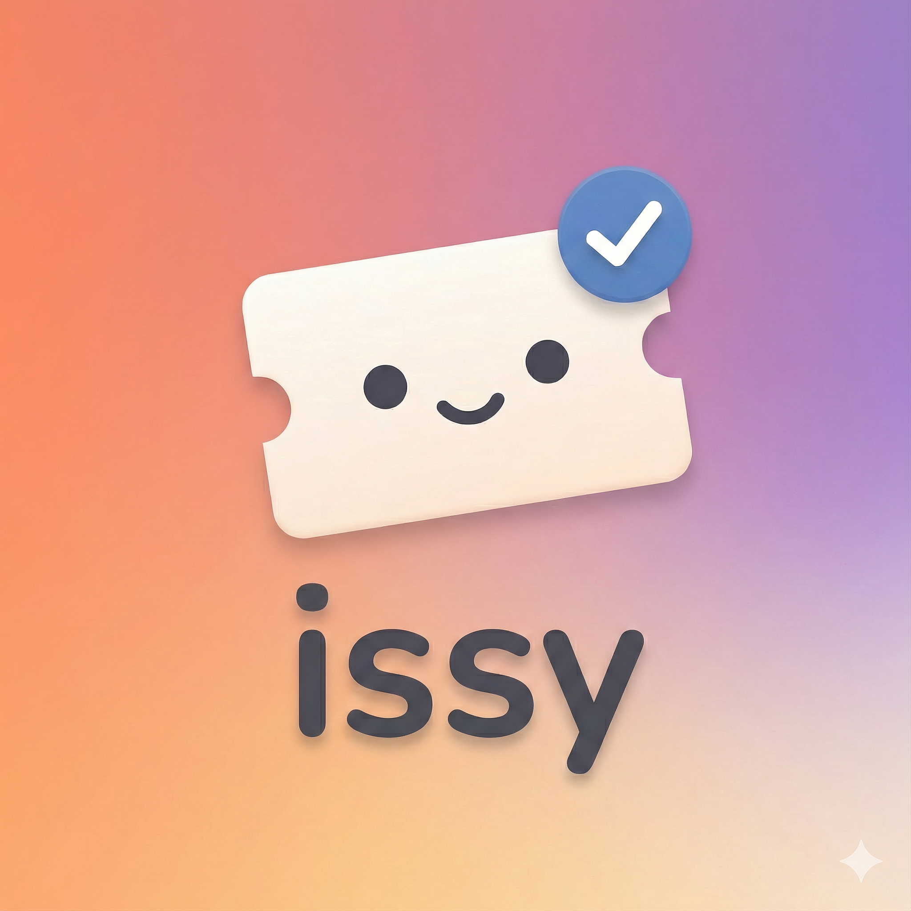

<p align="center">
  
</p>

<p align="center">
  <a href="https://www.npmjs.com/package/issy"></a>
  <a href="https://www.npmjs.com/package/issy"></a>
  <a href="https://github.com/miketromba/issy/blob/main/LICENSE"></a>
</p>

<p align="center">
  <strong>AI-native issue tracking.</strong><br>
  Tell your coding assistant what to track. It handles the rest.
</p>

---

## How It Works

issy gives AI coding assistants a skill for managing issues. Just talk naturally:

> "Create a bug for the login redirect issue, high priority"

> "What issues are open?"

> "Close the auth bug, it's fixed"

The assistant creates, searches, updates, and closes issues for you. Issues are stored as markdown files in `.issues/` — readable, diffable, and committed with your code.

## Install the Skill

```bash
npx skills add miketromba/issy
```

That's it. Your AI assistant can now manage issues in any repo.

## Why Markdown?

- **Portable** — No vendor lock-in, no database, no accounts
- **Git-native** — Issues travel with your code, appear in diffs and PRs
- **Transparent** — AI agents can read and write issues directly
- **Works offline** — No network dependency

---

## Installing `issy`

`issy` can be installed both globally **and** in your repository. We recommend installing both ways so you can take advantage of fast, convenient workflows *and* a stable version for all developers in your repository.

### Global installation

A global install of `issy` brings flexibility and speed to your local workflows.

```bash
# npm
npm install issy --global

# pnpm
pnpm add issy --global

# yarn
yarn global add issy

# bun
bun install issy --global
```

Once installed globally, you can run commands from your terminal:

```bash
issy                          # Start the web UI
issy list                     # List open issues
issy create --title "Bug"     # Create issue
```

### Repository installation

When collaborating with other developers, it's a good idea to pin versions. Add `issy` as a `devDependency` in the root of your repository:

```bash
# npm
npm install issy --save-dev

# pnpm
pnpm add issy --save-dev --ignore-workspace-root-check

# yarn
yarn add issy --dev --ignore-workspace-root-check

# bun
bun add issy --dev
```

You can continue to use your global installation to run commands. Global `issy` will defer to the local version if it exists.

---

## Usage

### Web UI

```bash
issy
```

Opens a local UI at `http://localhost:1554` for browsing and editing issues.

<p align="center">
  
</p>

### CLI

```bash
issy init                     # Create .issues/ directory
issy init --seed              # Create with a welcome issue
issy list                     # List open issues
issy search "auth"            # Fuzzy search
issy read 0001                # View issue
issy create --title "Bug"     # Create issue
issy close 0001               # Close issue
issy --version                # Check version
```

Run `issy help` for full options.

### Monorepo Support

issy automatically walks up from the current directory to find an existing `.issues/` folder. This means you can run `npx issy` from any subdirectory (e.g., `packages/foo/`) and it will find and use the repo root's issues.

```bash
# In a monorepo, issues are typically at the root:
my-monorepo/
  .issues/           # ← issy finds this automatically
  packages/
    frontend/        # ← works from here
    backend/         # ← or here
```

---

## Issue Format

```markdown
---
title: Fix login redirect
description: Users get stuck after OAuth callback
priority: high
scope: medium
type: bug
status: open
created: 2025-01-15T10:30:00
---

## Problem

After OAuth login, users are redirected to `/callback` but the
session isn't established, causing a redirect loop.
```

| Field | Values |
|-------|--------|
| `priority` | `high`, `medium`, `low` |
| `scope` | `small`, `medium`, `large` (optional) |
| `type` | `bug`, `improvement` |
| `status` | `open`, `closed` |
| `labels` | comma-separated (optional) |

## Configuration

| Variable | Description | Default |
|----------|-------------|---------|
| `ISSUES_DIR` | Issues directory path | `./.issues` |
| `ISSUES_PORT` | UI server port | `1554` |

<details>
<summary><strong>Development</strong></summary>

```
packages/
  cli/   → CLI (issy)
  core/  → Storage library (@miketromba/issy-core)
  ui/    → Web UI + API (@miketromba/issy-app)
```

```bash
bun install && bun run dev
```

</details>

## License

MIT
